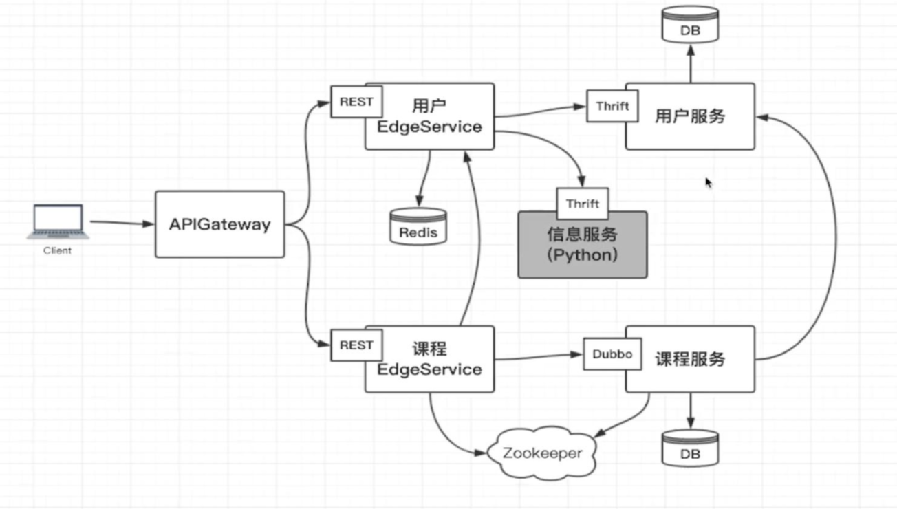

# alpha-rpc

## Arch Design
- Message Service (9090): python + thrift




## Prerequisites

### thrift
https://www.imooc.com/article/30296

1. Download thrift [thrift.apache.org](http://thrift.apache.org)
2. Config
```
./configure --with-qt4=no  --with-qt5=no  --with-c_glib=no  --with-csharp=no  --with-erlang=no  --with-nodejs=no  --with-lua=no  --with-perl=no  --with-php=no  --with-php_extension=no  --with-dart=no  --with-ruby=no  --with-haskell=no  --with-go=no  --with-haxe=no  --with-d=no
```
3. Make
```
make && make install
```


### mysql
```
cd docker/mysql
sh run-mysql.sh
```

or 

```
#!/usr/bin/env bash
cur_dir=`pwd`
docker stop alpha-rpc-mysql
docker rm alpha-rpc-mysql
docker run --name alpha-rpc-mysql -v ${cur_dir}/conf:/etc/mysql/conf.d -v ${cur_dir}/data:/var/lib/mysql -p 3306:3306 -e MYSQL_ROOT_PASSWORD=qwer1234 -d mysql:latest
```

**db tables:**  

1. `db_user.pe_user`   
- `id` int
- `username` varchar
- `password` varchar
- `real_name` varchar
- `mobile` varchar
- `email` varchar

2. `db_user.pe_teacher`
- `user_id` int
- `intro` varchar
- `desc` varchar

3. `db_course.pe_course`
- `id` int
- `title` varchar
- `desc` varchar

4. `db_course.pr_user_course`
- `user_id` int
- `course_id` int

### redis
```
cd docker/redis
sh run-redis.sh
```

or 

```
#!/usr/bin/env bash
docker stop alpha-rpc-redis
docker rm alpha-rpc-redis
docker run --name alpha-rpc-redis -idt -p 6379:6379 -v `pwd`/data:/data -v `pwd`/conf/redis.conf:/etc/redis/redis_default.conf redis:latest
```

test connection:
```
netstat -na | grep 6379

telnet localhost 6379
set a b
get a
```

### zookeeper for dubbo

```
cd docker/zookeeper
sh run-zk.sh
```

or 

```
docker stop alpha-rpc-zk
docker rm alpha-rpc-zk
docker run --name alpha-rpc-zk -p2181:2181 --restart always -d zookeeper:3.5
```


